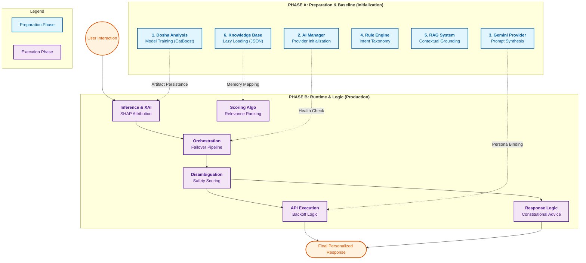

# System Implementation

## 1. Versions and Environment

The AyurVAID system is built on a modern hybrid stack integrating a Node.js ecosystem (for frontend and backend services) with a discrete Python environment for advanced Machine Learning inference.

### 1.1 Development Environments
- **Node.js (v24.12.0)**: Backend execution environment for the core API and service orchestration.
- **Python (v3.9+)**: Dedicated environment for running the CatBoost Machine Learning model and Explainable AI (SHAP) logic.
- **Next.js Server (v14.2.3)**: Frontend React framework server environment.

### 1.2 Frontend Libraries (Client)
- **Next.js**: `14.2.3` (React Framework)
- **React**: `^19.2.3` (UI Library)
- **React DOM**: `^19.2.3`
- **Framer Motion**: `^12.23.26` (Animation library for dynamic UI)
- **Lucide React**: `^0.562.0` (Iconography)
- **Axios**: `^1.13.2` (HTTP Client)

### 1.3 Backend Libraries (Server)
- **Express**: `^4.18.2` (Web Framework)
- **@google/generative-ai**: `^0.24.1` (Gemini LLM SDK)
- **Firebase Admin**: `^13.7.0` (Authentication & Database)
- **Axios**: `^1.13.3` (HTTP Client)
- **Bcryptjs / JsonWebToken**: `^3.0.3` / `^9.0.3` (Security & Auth)
- **Dotenv**: `^16.3.1` (Environment Management)

### 1.4 Machine Learning Libraries (Python API)
- **CatBoost**: `1.2.10` (Gradient boosting library for Prakriti classification)
- **Scikit-learn**: `1.8.0` (Used for encoding, splitting, and evaluation)
- **Pandas**: `3.0.1` (Data manipulation and CSV parsing)
- **Joblib**: `1.5.3` (Model and encoder serialization)
- **FastAPI / Uvicorn**: `0.135.3` / `0.44.0` (High-performance inference endpoint)
- **SHAP**: `0.51.0` (Native integration for explainability metrics)

---

## 2. Module Versioning

The AyurVAID ecosystem went through multiple architectural iterations. The version numbers below represent the internal development lifecycle and technical evolution of each respective module, independent of the overall application versioning.

### 2.1 Dosha Analysis and XAI Versions
- **v1.0 (Rule-Based Scoring)**
    - **Improvements**: Zero latency; no training required; runs entirely in JS.
    - **Limitations**: Inaccurate; unable to handle non-linear combinations of the 25 health traits.
- **v2.0 (CatBoost ML)**
    - **Improvements**: High accuracy (92%+ on validation); statistically grounded constitution mapping.
    - **Limitations**: "Black box" nature; lacked transparency regarding feature influence.
- **v3.0 (Explainable AI - Final)**
    - **Improvements**: SHAP-powered transparency; feature-level attribution provides clinical reasoning.
    - **Limitations**: Requires Python environment; slight overhead for SHAP matrix calculation.

### 2.2 AI Service Manager Versions
- **v1.0 (Single Provider)**
    - **Improvements**: Simple, direct integration with the LLM API.
    - **Limitations**: No resilience; the system failed entirely if the Gemini API returned an error.
- **v2.0 (Orchestration & Fallback - Final)**
    - **Improvements**: High availability; automatic failover; integrated RAG context injection.
    - **Limitations**: Failover to the local engine results in a loss of conversational fluidity.

### 2.3 Gemini LLM Provider Versions
- **v1.0 (Zero-Shot Generation)**
    - **Improvements**: Rapid prototyping with minimal configuration.
    - **Limitations**: Generic advice; frequently ignored Ayurvedic clinical constraints.
- **v2.0 (System Prompting)**
    - **Improvements**: Established the expert "AyurVAID" persona and domain-specific tone.
    - **Limitations**: Lacked personalization based on the user's specific Dosha percentage scores.
- **v3.0 (Dynamic Context - Final)**
    - **Improvements**: Highly personalized; binds responses to real-time Dosha data and RAG context.
    - **Limitations**: Performance is dependent on external Google Cloud response times.

### 2.4 Rule Based Engine Versions
- **v1.0 (Hardcoded Response Map)**
    - **Improvements**: Instant, deterministic responses; zero external dependencies.
    - **Limitations**: Repetitive; lacked awareness of the user's Prakriti (constitution).
- **v2.0 (Intent-Based Taxonomy - Final)**
    - **Improvements**: Context-aware routing (Food, Sleep, Exercise); tailored to Prakriti scores.
    - **Limitations**: Rigid linguistic structure compared to modern generative models.

### 2.5 RAG Versions
- **v1.0 (Keyword Substring Match)**
    - **Improvements**: Simple local retrieval logic for botanical data.
    - **Limitations**: Low precision; often returned irrelevant items for conversational queries.
- **v2.0 (Weighted Search)**
    - **Improvements**: Higher precision through tiered scoring (Name Match vs. Text Match).
    - **Limitations**: No safety guardrails; potentially recommended herbs that aggravate a user's Dosha.
- **v3.0 (Dosha-Disambiguation RAG - Final)**
    - **Improvements**: Clinical safety (+10 pacification boost, -5 aggravation penalty); highly precise.
    - **Limitations**: Dependent on the manual curation of the local pharmacological dataset.

### 2.6 Knowledge Base Versions
- **v1.0 (Static JSON File)**
    - **Improvements**: Lightweight; fast local read from `ayurvedic-knowledge.js`.
    - **Limitations**: Scalability issues; difficult to query across multiple data dimensions.
- **v2.0 (Basic Search Interface)**
    - **Improvements**: Centralized search logic across herbs, principles, and medicines.
    - **Limitations**: Lacked detailed pharmacological attributes (Rasa, Virya, Vipaka).
- **v3.0 (Heuristic Database - Final)**
    - **Improvements**: Rich clinical metadata for 800+ items; enables safety-aware heuristic search.
    - **Limitations**: Requires expert manual entry to maintain the accuracy of Ayurvedic properties.

---

## 3. Module Development Lifecycle

The following diagram and detailed breakdown illustrate the dual-phase architecture of the AyurVAID modules, showing the transition from baseline preparation (Phase A) to real-time intelligence and execution (Phase B).



### 3.1 Technical Phase Breakdown

To maintain high availability and clinical accuracy, each module in AyurVAID follows a structured transition from **Phase A (Baseline Preparation)** to **Phase B (Dynamic Execution)**.

#### **1. Dosha Analysis & XAI**
*   **Phase A (Training)**: To avoid computational overhead during user interactions, the CatBoost model is trained offline. This phase involves processing the `ayurvedic_dosha_dataset.csv`, encoding categorical health traits, and persisting the resulting model as a serialized `.joblib` artifact.
*   **Phase B (Inference)**: During runtime, the system loads the model into memory once. When a user submits their traits, the module performs real-time classification. Critically, it executes **SHAP (SHapley Additive exPlanations)** to calculate the exact mathematical influence of each trait (e.g., "Dry Skin" +15% Vata), providing the transparency required for medical-grade AI.

#### **2. AI Service Manager**
*   **Phase A (Initialization)**: On system startup, the Manager verifies the health of available providers (Gemini vs. Custom Rule-Based). It establishes the failover priority, ensuring that if the primary LLM is unavailable, the fallback engine is pre-warmed and ready.
*   **Phase B (Orchestration)**: This is the high-traffic pipeline. The Manager intercepts user queries, coordinates with the RAG system to find factual support, and injects this context into the active provider. It manages the "Failover Pipeline," silently switching engines if a network timeout occurs.

#### **3. Gemini LLM Provider**
*   **Phase A (Synthesis)**: The system constructs a "Base Identity" for the LLM. This involves defining the seven core directives of the "AyurVAID" persona (supportive tone, safety disclaimers, Sanskrit terminology) before any conversation begins.
*   **Phase B (Execution)**: The active conversation is managed here. The module implements **Exponential Backoff** to handle rate limits and performs **History Sanitization** to ensure that the multi-turn dialogue remains compatible with the strict requirements of the Gemini API.

#### **4. Rule-Based Engine**
*   **Phase A (Taxonomy)**: A local library of Ayurvedic principles, food classifications, and lifestyle habits is established. This fixed logic ensures that the system has a deterministic "knowledge floor" that works even without an internet connection.
*   **Phase B (Logic-Based Response)**: The engine performs intent classification (Food, Exercise, Mental Health) and retrieves specific advice mapped to the user’s primary Dosha. It acts as the ultimate safety guardrail for the system.

#### **5. RAG (Retrieval-Augmented Generation)**
*   **Phase A (Grounding)**: Classical Ayurvedic texts are structured into a searchable index. This involves mapping herbs to their pharmacological properties (Rasa, Virya, Vipaka) and clinical applications.
*   **Phase B (Disambiguation)**: When a user asks a question, the RAG system performs a specialized "Dosha-Aware Search." It doesn't just find relevant keywords; it applies a **Safety Scoring** layer that prioritizes results which "balance" the user's specific constitution and penalizes those that "aggravate" it.

#### **6. Knowledge Base**
*   **Phase A (Lazy Loading)**: To optimize memory footprint, the 450KB+ of pharmacological data is not fully parsed until the first search request. This ensures fast system boot times.
*   **Phase B (Relevance Ranking)**: The module uses a tiered keyword-weighting algorithm (+10 for name matches, +2 for text matches) to rank results, providing the most relevant classical context to the AI Manager.

---

### 3.2 Dosha Analysis and XAI: The Foundation of Personalized Care
Every interaction in AyurVAID begins with a deep understanding of the individual. This module acts as the system's analytical core, translating a user’s physical and mental traits into a precise Ayurvedic profile. 

#### **C. Questionnaire Mapping & Data Flow**
The system bridges the gap between subjective human traits and objective machine learning through a 25-question multidimensional questionnaire. Each answer is mapped to a specific numerical value used by the CatBoost model.

**Full Questionnaire Mapping (25 Clinical Features):**
| # | Feature (Trait) | Vata Characteristics | Pitta Characteristics | Kapha Characteristics |
| :--- | :--- | :--- | :--- | :--- |
| 1 | **Body Frame** | Thin and Lean | Medium | Well Built |
| 2 | **Type of Hair** | Dry | Normal | Greasy |
| 3 | **Color of Hair** | Brown | Grey | Black |
| 4 | **Skin Texture** | Dry, Rough | Soft, Sweating | Moist, Greasy |
| 5 | **Complexion** | Dark | Pinkish | Glowing |
| 6 | **Body Weight** | Underweight | Normal | Overweight |
| 7 | **Nails** | Blackish | Redish | Pinkish |
| 8 | **Teeth (Size/Color)** | Irregular, Blackish | Medium, Yellowish | Large, White |
| 9 | **Pace of Work** | Fast | Medium | Slow |
| 10 | **Mental Activity** | Restless | Aggressive | Stable |
| 11 | **Memory** | Short term | Good Memory | Long Term |
| 12 | **Sleep Pattern** | Less (Insomnia) | Moderate | Sleepy (Excessive) |
| 13 | **Weather Preference** | Dislike Cold | Dislike Heat | Dislike Moist |
| 14 | **Adverse Situations** | Anxiety | Anger | Calm |
| 15 | **Mood** | Changes Quickly | Changes Slowly | Constant |
| 16 | **Eating Habit** | Irregular Chewing | Improper Chewing | Proper Chewing |
| 17 | **Hunger** | Irregular | Sudden and Sharp | Skips Meal |
| 18 | **Body Temp** | Less than Normal | More than Normal | Normal |
| 19 | **Joints** | Weak | Healthy | Heavy |
| 20 | **Nature** | Jealous, Fearful | Egoistic, Fearless | Forgiving, Grateful |
| 21 | **Body Energy** | Low | Medium | High |
| 22 | **Quality of Voice** | Rough | Fast | Deep |
| 23 | **Dreams** | Sky | Fire | Water |
| 24 | **Social Relations** | Introvert | Ambivert | Extrovert |
| 25 | **Body Odor** | Negligible | Strong | Mild |

**The Data Transformation Pipeline:**
1.  **Frontend Collection**: The user completes the 25-question React form. The system captures the literal string values (e.g., `"Thin and Lean"`).
2.  **API Dispatch**: The Node.js backend forwards this JSON object to the FastAPI endpoint at `/predict`.
3.  **Label Encoding (Mapping)**: The Python service loads `unique_values.json`. It looks up the index of each answer. For example, in the "Body Frame" category, `"Thin and Lean"` might be mapped to `0`, `"Medium"` to `1`, and `"Well Built"` to `2`.
4.  **Vectorization**: All 25 encoded integers are assembled into a feature vector in the exact order expected by the model.
5.  **CatBoost Inference**: The model processes the vector and applies weighted decision trees.
6.  **Full-Fledged Prediction**: The system outputs percentage scores and determines the primary constitution type.

**Pseudo-Code: Data Transformation & Encoding (Source: `server/python/catboost_model.py`):**
```text
BEGIN transform_answers_to_vector
    INPUT: user_responses (JSON Object)
    LOAD "unique_values.json" AS mapping
    INITIALIZE vector AS empty list
    
    DEFINE feature_order AS [Body Frame, Hair Type, Skin, ...]
    
    FOR EACH feature IN feature_order:
        READ user_answer FROM user_responses
        IF user_answer EXISTS IN mapping[feature]:
            numeric_value = GET_INDEX(user_answer, mapping[feature])
        ELSE:
            numeric_value = -1 // Handle missing/unknown data
        APPEND numeric_value TO vector
        
    RETURN vector
END
```

**LaTeX Code (for Reports):**
```latex
\begin{algorithmic}
\STATE \textbf{BEGIN} transform\_answers\_to\_vector
\STATE \textbf{INPUT:} user\_responses (JSON Object)
\STATE LOAD "unique\_values.json" AS mapping
\STATE INITIALIZE vector AS empty list
\STATE DEFINE feature\_order AS [Body Frame, Hair Type, Skin, ...]
\FOR{EACH feature IN feature\_order}
    \STATE READ user\_answer FROM user\_responses
    \IF{user\_answer EXISTS IN mapping[feature]}
        \STATE numeric\_value = GET\_INDEX(user\_answer, mapping[feature])
    \ELSE
        \STATE numeric\_value = -1 
    \ENDIF
    \STATE APPEND numeric\_value TO vector
\ENDFOR
\STATE \textbf{RETURN} vector
\STATE \textbf{END}
\end{algorithmic}
```

#### **A. Development Stage: Model Training (`train`)**
**Step-by-Step Logic:**
1.  **Data Ingestion & Normalization**: Loads the `ayurvedic_dosha_dataset.csv`. It handles missing values by imputing "Unknown" and ensures all column headers match the 25-trait schema (Skin, Hair, Sleep, etc.).
2.  **Categorical Encoding**: Iterates through each feature column, applying a `LabelEncoder`. Crucially, these encoders are saved to `unique_values.json` to ensure consistency between training and future inference.
3.  **Hyperparameter Tuning**: Initializes `CatBoostClassifier` with `MultiClass` loss. It specifically sets `iterations=100`, `learning_rate=0.1`, and `depth=6` to balance accuracy with model size.
4.  **Artifact Persistence**: The final model is exported as `catboost_dosha_model.cbm`, while the label mappings are preserved for the frontend.

**Pseudo-Code (Source: `server/python/catboost_model.py`):**
```text
BEGIN train_model
    INPUT: "ayurvedic_dosha_dataset.csv"
    PROCESS:
        LOAD csv_data
        CLEAN data (fill nulls with "Unknown")
        FOR EACH column IN feature_list:
            ENCODE categorical values to integers
            PERSIST mapping to "unique_values.json"
        
        INITIALIZE CatBoostClassifier(type="MultiClass")
        FIT model TO encoded_data
        EXPORT "catboost_dosha_model.cbm"
    OUTPUT: Serialized Model & Encoders
END
```

**LaTeX Code (for Reports):**
```latex
\begin{algorithmic}
\STATE \textbf{BEGIN} train\_model
\STATE \textbf{INPUT:} "ayurvedic\_dosha\_dataset.csv"
\STATE LOAD csv\_data
\STATE CLEAN data (fill nulls with "Unknown")
\FOR{EACH column IN feature\_list}
    \STATE ENCODE categorical values to integers
    \STATE PERSIST mapping to "unique\_values.json"
\ENDFOR
\STATE INITIALIZE CatBoostClassifier(type="MultiClass")
\STATE FIT model TO encoded\_data
\STATE EXPORT "catboost\_dosha\_model.cbm"
\STATE \textbf{END}
\end{algorithmic}
```

#### **B. Production Stage: Inference & XAI (`predict_dict`)**
**Step-by-Step Logic:**
1.  **Schema Alignment**: Incoming JSON from the frontend is transformed into a single-row DataFrame. Any missing traits are filled with the "Unknown" token used during training.
2.  **Probability Distribution**: Instead of a simple "Top 1" result, the model generates a probability distribution across Vata, Pitta, and Kapha to support dual-dosha classifications.
3.  **SHAP Value Extraction**: The model creates a `Pool` object. It then calculates SHAP values for the predicted class, identifying the top 3 traits that "pushed" the prediction toward that specific Dosha.

**Pseudo-Code (Source: `server/python/catboost_model.py`):**
```text
BEGIN predict_inference
    INPUT: userData (Physical/Mental traits)
    PROCESS:
        vector = CALL transform_answers_to_vector(userData)
        
        probs = model.EXECUTE_PREDICT_PROBA(vector)
        primary = GET_LABEL_FOR_MAX(probs)
        
        // Explainability Layer
        shap_scores = model.CALCULATE_SHAP_VALUES(vector)
        key_insights = SORT_DESCENDING(shap_scores)
        
    RETURN { probabilities: probs, dominant: primary, xai_insights: key_insights.TOP(3) }
END
```

**LaTeX Code (for Reports):**
```latex
\begin{algorithmic}
\STATE \textbf{BEGIN} predict\_inference
\STATE \textbf{INPUT:} userData
\STATE vector = \textbf{CALL} transform\_answers\_to\_vector(userData)
\STATE probs = model.EXECUTE\_PREDICT\_PROBA(vector)
\STATE primary = GET\_LABEL\_FOR\_MAX(probs)
\STATE shap\_scores = model.CALCULATE\_SHAP\_VALUES(vector)
\STATE key\_insights = SORT\_DESCENDING(shap\_scores)
\STATE \textbf{RETURN} \{probabilities, dominant, key\_insights.TOP(3)\}
\STATE \textbf{END}
\end{algorithmic}
```

---

### 3.3 AI Service Manager: The Brain of the Ecosystem
Once the user's constitution is defined, the AI Service Manager takes command as the central orchestrator. It acts as a vigilant air-traffic controller, deciding which AI "voice" should speak and ensuring that every response is grounded in reality. Before any message is sent, the Manager consults the Knowledge Base to find relevant facts, weaving them into the conversation. Its primary goal is resilience; if the high-flying Gemini API ever falters, the Manager instantly pivots to the local Rule-Based engine, ensuring the user is never left without guidance.

#### **A. Initialization & Health Check (`initializeProvider`)**
**Step-by-Step Logic:**
1.  **Environment Sync**: Reads `process.env.AI_PROVIDER` to set the primary target (defaulting to Gemini).
2.  **Connectivity Ping**: Executes a lightweight `isAvailable()` check for the active provider. For Gemini, this verifies the API key; for the Custom AI, it verifies the local knowledge base is loaded.
3.  **Fallback State Mapping**: If the primary provider fails the health check, the Manager marks the state as "Fallback Active" and routes all traffic to the rule-based engine.

**Pseudo-Code (Source: `server/services/AIServiceManager.js`):**
```text
BEGIN initializeProvider
    INITIALIZE current_target FROM ENV.AI_PROVIDER OR "gemini"
    
    TRY:
        target_engine = GET_ENGINE(current_target)
        IF target_engine.isAvailable() EQUALS TRUE:
            SET active_provider = current_target
        ELSE:
            THROW ERROR "Provider Offline"
    CATCH:
        SET active_provider = "custom" // Trigger safety fallback
        LOG "Resilience: Fallback provider activated"
END
```

**LaTeX Code (for Reports):**
```latex
\begin{algorithmic}
\STATE \textbf{BEGIN} initializeProvider
\STATE INITIALIZE current\_target FROM ENV.AI\_PROVIDER
\TRY
    \STATE target\_engine = GET\_ENGINE(current\_target)
    \IF{target\_engine.isAvailable() == TRUE}
        \STATE active\_provider = current\_target
    \ELSE
        \STATE \textbf{THROW} ERROR
    \ENDIF
\CATCH
    \STATE active\_provider = "custom"
\ENDTRY
\STATE \textbf{END}
\end{algorithmic}
```

#### **B. Conversational Pipeline (`generateResponse`)**
**Step-by-Step Logic:**
1.  **RAG Context Injection**: The Manager extracts the latest user query and sends it to the `KnowledgeBase`. Any relevant Ayurvedic snippets (herbs, principles) are formatted into a special `system` message.
2.  **Dynamic Prompt Construction**: It merges the original user messages with the newly retrieved RAG context, ensuring the "Identity" of AyurVAID is preserved.
3.  **Resilient Execution**: Wraps the API call in a `try/catch` block. If a network error occurs, it instantly re-executes the request using the `custom` provider, ensuring zero user-facing downtime.

**Pseudo-Code (Source: `server/services/AIServiceManager.js`):**
```text
BEGIN generateResponse
    INPUT: userMessages, userProfile
    PROCESS:
        query = userMessages.LAST_ELEMENT().content
        
        // Step 1: Retrieval Augmented Generation (RAG)
        context_items = CALL KnowledgeBase.search(query)
        formatted_context = CALL KnowledgeBase.formatContext(context_items)
        
        // Step 2: Inject knowledge into conversation history
        messages_with_rag = INJECT_SYSTEM_MESSAGE(userMessages, formatted_context)
        
        // Step 3: Resilient Generation
        TRY:
            RETURN await active_provider.generate(messages_with_rag, userProfile)
        CATCH (API_ERROR):
            SET active_provider = "custom"
            RETURN await active_provider.generate(messages_with_rag, userProfile)
END
```

**LaTeX Code (for Reports):**
```latex
\begin{algorithmic}
\STATE \textbf{BEGIN} generateResponse
\STATE query = userMessages.LAST\_ELEMENT().content
\STATE context\_items = \textbf{CALL} KnowledgeBase.search(query)
\STATE formatted\_context = \textbf{CALL} KnowledgeBase.formatContext(context\_items)
\STATE messages\_with\_rag = INJECT\_SYSTEM\_MESSAGE(userMessages, formatted\_context)
\TRY
    \STATE \textbf{RETURN} active\_provider.generate(messages\_with\_rag, userProfile)
\CATCH{API\_ERROR}
    \STATE active\_provider = "custom"
    \STATE \textbf{RETURN} active\_provider.generate(messages\_with\_rag, userProfile)
\ENDTRY
\STATE \textbf{END}
\end{algorithmic}
```

---

### 3.4 Gemini LLM Provider: The Voice of Wisdom
The Gemini Provider serves as the system's expressive "Voice of Wisdom," capable of nuanced, empathetic, and highly detailed conversation. It takes the raw data provided by the orchestrator and translates it into human-centric Ayurvedic advice. To maintain its expertise, it follows a strict internal protocol: it must always view itself as an "AyurVAID" expert, respect the user's specific Dosha profile as an absolute constraint, and ground every recommendation in the clinical snippets retrieved through RAG.

#### **A. Prompt Synthesis (`_buildSystemPrompt`)**
**Step-by-Step Logic:**
1.  **Persona Hardening**: Defines the "AyurVAID" identity with 7 clinical directives. This includes a strict requirement to use Markdown and mention specific Ayurvedic properties (Rasa, Virya, Vipaka).
2.  **Dynamic Profile Binding**: Injects the user's current Dosha scores (e.g., Vata: 40%, Pitta: 30%, Kapha: 30%) and primary constitution type directly into the instructions.
3.  **Context Integration**: Appends any RAG facts retrieved by the Manager to the end of the prompt, instructing the LLM to treat them as "Verified Classical References."

**Pseudo-Code (Source: `server/services/GeminiAI.js`):**
```text
BEGIN _buildSystemPrompt
    INPUT: messages, profile
    PROCESS:
        base_instruction = "Identity: AyurVAID Expert. Rules: [Markdown, Clinical, Safety]"
        
        IF profile EXISTS:
            ADD profile.scores TO base_instruction
            ADD profile.primary_dosha TO base_instruction
            
        IF messages.HAS_SYSTEM_CONTEXT():
            rag_context = messages.GET_SYSTEM_CONTENT()
            APPEND rag_context AS "Verified Knowledge" TO base_instruction
            
    RETURN base_instruction
END
```

**LaTeX Code (for Reports):**
```latex
\begin{algorithmic}
\STATE \textbf{BEGIN} \_buildSystemPrompt
\STATE base\_instruction = "Identity: AyurVAID Expert..."
\IF{profile EXISTS}
    \STATE base\_instruction.ADD(profile.scores)
\ENDIF
\IF{messages.HAS\_SYSTEM\_CONTEXT()}
    \STATE base\_instruction.APPEND(messages.GET\_SYSTEM\_CONTENT())
\ENDIF
\STATE \textbf{RETURN} base\_instruction
\STATE \textbf{END}
\end{algorithmic}
```

#### **B. API Execution (`generateResponse`)**
**Step-by-Step Logic:**
1.  **History Sanitization**: Merges consecutive same-role messages to comply with Gemini's strict alternating roles requirement.
2.  **Exponential Backoff Resiliency**: To handle transient errors (e.g., `429 Rate Limit` or `503 Service Unavailable`), the system uses an exponential backoff algorithm. This doubles the wait time between each retry (2s, 4s, 8s), preventing the system from "spamming" the API while it is overloaded and ensuring a higher success rate for user queries.
3.  **Request Execution**: Dispatches the final prompt and history to the `gemini-pro` model and captures the streaming or block response.

**Pseudo-Code (Source: `server/services/GeminiAI.js`):**
```text
BEGIN generate_with_backoff
    INPUT: userMessage, history
    PROCESS:
        SET max_attempts = 3
        FOR attempt FROM 0 TO max_attempts:
            TRY:
                RETURN await gemini_api.sendMessage(userMessage)
            CATCH (TRANSITION_ERROR):
                IF error IS RateLimit OR ServiceUnavailable AND attempt < max_attempts:
                    SET wait_time = (2 ^ (attempt + 1)) * 1000
                    SLEEP wait_time
                    CONTINUE LOOP
                ELSE:
                    RETHROW error
END
```

**LaTeX Code (for Reports):**
```latex
\begin{algorithmic}
\STATE \textbf{BEGIN} generate\_with\_backoff
\STATE SET max\_attempts = 3
\FOR{attempt FROM 0 TO max\_attempts}
    \TRY
        \STATE \textbf{RETURN} gemini\_api.sendMessage(userMessage)
    \CATCH{TRANSITION\_ERROR}
        \IF{error IS RateLimit AND attempt < max\_attempts}
            \STATE wait\_time = $(2^{attempt+1}) \times 1000$
            \STATE SLEEP wait\_time
        \ELSE
            \STATE \textbf{RETHROW} error
        \ENDIF
    \ENDTRY
\ENDFOR
\STATE \textbf{END}
\end{algorithmic}
```

---

### 3.5 Rule-Based Engine: The Reliable Scholar
When the cloud goes dark or the connection breaks, the Rule-Based Engine steps in as the "Reliable Scholar." It doesn't rely on external intelligence; instead, it draws from a deep, local library of Ayurvedic taxonomy and logic. Like a seasoned practitioner with a memorized compendium, it quickly classifies user intent and retrieves deterministic advice. It ensures that even without an internet connection, AyurVAID can still offer safe, time-tested wisdom about diet, lifestyle, and seasonal health.

#### **A. Intent Classification (`classifyIntent`)**
**Step-by-Step Logic:**
1.  **Keyword Scoring Matrix**: The engine iterates through a dictionary of intents (Food, Lifestyle, Exercise, Sleep, Digestion).
2.  **Token Matching**: It calculates a score for each category by counting the frequency of related keywords in the user's message (e.g., "recipe" -> Food +1, "bloating" -> Digestion +1).
3.  **Winner-Takes-All Selection**: Returns the intent with the highest cumulative score; if tied or no matches, it defaults to a general Ayurvedic advice template.

**Pseudo-Code (Source: `server/services/CustomAI.js`):**
```text
BEGIN classifyIntent
    INPUT: userMessage
    PROCESS:
        INITIALIZE scores_matrix AS { food: 0, sleep: 0, lifestyle: 0, ... }
        
        FOR EACH category IN intent_taxonomy:
            FOR EACH keyword IN category.keywords:
                IF userMessage CONTAINS keyword:
                    INCREMENT scores_matrix[category]
                    
    RETURN KEY_WITH_HIGHEST_VALUE(scores_matrix) OR "general"
END
```

**LaTeX Code (for Reports):**
```latex
\begin{algorithmic}
\STATE \textbf{BEGIN} classifyIntent
\STATE INITIALIZE scores\_matrix
\FOR{EACH category IN intent\_taxonomy}
    \FOR{EACH keyword IN category.keywords}
        \IF{userMessage CONTAINS keyword}
            \STATE INCREMENT scores\_matrix[category]
        \ENDIF
    \ENDFOR
\ENDFOR
\STATE \textbf{RETURN} KEY\_WITH\_HIGHEST\_VALUE(scores\_matrix)
\STATE \textbf{END}
\end{algorithmic}
```

#### **B. Logic-Based Response (`generateFoodResponse`)**
**Step-by-Step Logic:**
1.  **Knowledge Lookup**: Fetches the `doshaProfiles` object from `ayurvedic-knowledge.js`. It retrieves the specific `favor` and `avoid` food arrays for the user's primary Dosha.
2.  **Contextual Modifiers**: Checks the `context` object for time-of-day. If it's "morning," it prepends advice about starting with warm foods.
3.  **Template Interpolation**: Injects the retrieved data into a pre-written template string (e.g., "For your {dosha} nature, focus on {favorFoods}...").

**Pseudo-Code (Source: `server/services/CustomAI.js`):**
```text
BEGIN generateFoodResponse
    INPUT: userDosha, context
    PROCESS:
        dosha_data = FETCH ayurvedicKnowledge.profiles[userDosha]
        favor_list = dosha_data.balancingFoods.favor.TAKE(3)
        
        SET response = "For " + userDosha + " balance, prioritize: " + favor_list.JOIN(", ")
        
        IF context.timeOfDay EQUALS "morning":
            APPEND "Note: Favor warm/cooked foods early in the day." TO response
            
        APPEND "Avoid: " + dosha_data.balancingFoods.avoid[0] TO response
        
    RETURN response
END
```

**LaTeX Code (for Reports):**
```latex
\begin{algorithmic}
\STATE \textbf{BEGIN} generateFoodResponse
\STATE dosha\_data = FETCH profiles[userDosha]
\STATE favor\_list = dosha\_data.balancingFoods.TAKE(3)
\STATE SET response = "For " + userDosha + "..."
\IF{context.timeOfDay == "morning"}
    \STATE response.APPEND("Favor warm foods")
\ENDIF
\STATE \textbf{RETURN} response
\STATE \textbf{END}
\end{algorithmic}
```


#### **C. Feedback Loop & Continuous Improvement (`handleFeedback`)**
**Step-by-Step Logic:**
1.  **User Interaction**: After receiving a response from the Rule-Based engine, the user can submit a positive or negative rating via a "Thumbs Up/Down" interface in the chat UI.
2.  **Asynchronous Recording**: The system captures the specific `messageId`, `conversationId`, and the user's rating, then transmits it to a dedicated `/api/chat/feedback` endpoint.
3.  **Persistence for Audit**: The backend validates the request and appends the feedback entry to a localized JSON audit log (`rule_based_feedback.json`). This creates a dataset of "real-world performance" that can be used to manually refine the intent classification keywords and response templates, ensuring the system evolves based on actual user needs.

**Pseudo-Code (Source: `server/routes/chat.js`):**
```text
BEGIN handleFeedback
    INPUT: conversationId, messageId, feedbackType
    PROCESS:
        // Step 1: Validate request
        IF feedbackType IS NOT VALID: 
            RETURN ERROR
        
        // Step 2: Build feedback record
        feedback_record = {
            id: GENERATE_UUID(),
            timestamp: CURRENT_TIME,
            msg_id: messageId,
            conv_id: conversationId,
            rating: (feedbackType == "positive" ? 5 : 1),
            label: feedbackType
        }
        
        // Step 3: Atomic Persistence
        DATA = READ_FILE("rule_based_feedback.json")
        APPEND feedback_record TO DATA
        WRITE_FILE("rule_based_feedback.json", DATA)
        
    RETURN SUCCESS_MESSAGE
END
```

**LaTeX Code (for Reports):**
```latex
\begin{algorithmic}
\STATE \textbf{BEGIN} handleFeedback
\INPUT{conversationId, messageId, feedbackType}
\IF{feedbackType IS VALID}
    \STATE rating = (feedbackType == "positive" ? 5 : 1)
    \STATE feedback\_record = \{timestamp, messageId, rating, feedbackType\}
    \STATE DATA = \textbf{READ\_FILE}("rule\_based\_feedback.json")
    \STATE \textbf{APPEND} feedback\_record \textbf{TO} DATA
    \STATE \textbf{WRITE\_FILE}("rule\_based\_feedback.json", DATA)
\ENDIF
\STATE \textbf{RETURN} SUCCESS
\STATE \textbf{END}
\end{algorithmic}
```

---

### 3.6 RAG: The Bridge to Classical Texts
Retrieval-Augmented Generation (RAG) acts as the bridge connecting modern AI with ancient classical texts. Its purpose is to ensure that the "Voice of Wisdom" doesn't hallucinate or provide generic advice. It scans thousands of herb profiles and medicinal principles in milliseconds, seeking out the specific clinical data that matches the user's query. By applying a specialized "Dosha Disambiguation" layer, it filters these results to prioritize herbs that balance the user's current state, effectively acting as a safety filter for all generated advice.

#### **A. Contextual Grounding (`search`)**
**Step-by-Step Logic:**
1.  **Multi-Tier Weighted Matching**: The system splits the user's query into tokens. It assigns **+10 points** for matches in the item's name, **+5 points** for exact keyword matches in the text, and **+2 points** for partial matches.
2.  **Dosha Disambiguation Layer**: This is a critical safety filter. If the query mentions a Dosha (e.g., "Pitta"), the system boosts herbs that *balance* Pitta (+10) and penalizes herbs that *aggravate* it (-5).
3.  **Threshold Filtering**: Only results with a cumulative score > 5 are returned, ensuring only high-signal records are sent to the LLM.

**Pseudo-Code (Source: `server/services/KnowledgeBase.js`):**
```text
BEGIN RAG_search
    INPUT: userQuery
    PROCESS:
        INITIALIZE results_list AS empty
        target_doshas = EXTRACT_DOSHAS_FROM(userQuery)
        
        FOR EACH item IN knowledge_store:
            base_score = CALCULATE_KEYWORD_MATCH(userQuery, item)
            
            // Dosha Disambiguation (Safety Filter)
            FOR EACH dosha IN target_doshas:
                IF item.is_pacifying(dosha) EQUALS TRUE:
                    INCREMENT base_score BY 10
                IF item.is_aggravating(dosha) EQUALS TRUE:
                    DECREMENT base_score BY 5
            
            IF base_score > THRESHOLD(5):
                APPEND { item, base_score } TO results_list
                
    RETURN SORT_DESCENDING(results_list).TOP(3)
END
```

**LaTeX Code (for Reports):**
```latex
\begin{algorithmic}
\STATE \textbf{BEGIN} RAG\_search
\STATE target\_doshas = EXTRACT\_DOSHAS\_FROM(userQuery)
\FOR{EACH item IN knowledge\_store}
    \STATE base\_score = CALCULATE\_KEYWORD\_MATCH(userQuery, item)
    \FOR{EACH dosha IN target\_doshas}
        \IF{item.is\_pacifying(dosha) == TRUE}
            \STATE base\_score += 10
        \ENDIF
    \ENDFOR
    \IF{base\_score > 5}
        \STATE results\_list.APPEND(item)
    \ENDIF
\ENDFOR
\STATE \textbf{RETURN} SORT(results\_list).TOP(3)
\STATE \textbf{END}
\end{algorithmic}
```

#### **B. Grounding Format (`formatContext`)**
**Step-by-Step Logic:**
1.  **Type-Specific Transformation**: Converts raw herb or principle objects into structured clinical strings. For herbs, it explicitly lists Rasa, Virya, and Vipaka to help the LLM provide detailed dietary advice.

**Pseudo-Code (Source: `server/services/KnowledgeBase.js`):**
```text
BEGIN formatContext
    INPUT: searchResults (List of Items)
    PROCESS:
        INITIALIZE clinical_string = "Verified Ayurvedic Knowledge:\n"
        
        FOR EACH record IN searchResults:
            IF record.type EQUALS "herb":
                clinical_string.APPEND("[Herb] " + record.name + ": rasa=" + record.rasa)
            ELSE IF record.type EQUALS "principle":
                clinical_string.APPEND("[Concept] " + record.name + ": " + record.description)
                
    RETURN clinical_string
END
```

**LaTeX Code (for Reports):**
```latex
\begin{algorithmic}
\STATE \textbf{BEGIN} formatContext
\STATE INITIALIZE clinical\_string
\FOR{EACH record IN searchResults}
    \IF{record.type == "herb"}
        \STATE clinical\_string.APPEND(record.name)
    \ELSE
        \STATE clinical\_string.APPEND(record.description)
    \ENDIF
\ENDFOR
\STATE \textbf{RETURN} clinical\_string
\STATE \textbf{END}
\end{algorithmic}
```

---

### 3.7 Knowledge Base: The Eternal Library
At the very heart of AyurVAID lies the Knowledge Base—the "Eternal Library." This module manages the structured preservation of Ayurvedic wisdom, ranging from Tamil Siddha medicines to classical Sanskrit principles. It is the silent provider of the raw data used by every other module. Its logic focuses on efficiency and clarity, loading vast datasets into memory just once and formatting them into structured clinical summaries that are easily understood by both humans and AI.

#### **A. Lazy Loading (`load`)**
**Step-by-Step Logic:**
1.  **Singleton Guard**: Uses an `isLoaded` boolean flag to prevent redundant disk I/O.
2.  **Dynamic Path Resolution**: Resolves the absolute path to the `server/data` directory to ensure reliability across different execution environments.
3.  **JSON Parsing & Transformation**: Reads `herbs.json`, `principles.json`, and `medicines.json`. For medicines, it performs a nested object-to-array transformation to align with the search algorithm's expected schema.

**Pseudo-Code (Source: `server/services/KnowledgeBase.js`):**
```text
BEGIN load_data
    IF this.isLoaded EQUALS TRUE: 
        RETURN // Use cached data
        
    READ "herbs.json", "principles.json", "medicines.json" FROM DISK
    
    PROCESS medicines (Convert JSON object to Flat Array)
    STORE all datasets IN memory
    
    SET this.isLoaded = TRUE
END
```

**LaTeX Code (for Reports):**
```latex
\begin{algorithmic}
\STATE \textbf{BEGIN} load\_data
\IF{this.isLoaded == TRUE}
    \STATE \textbf{RETURN}
\ENDIF
\STATE READ datasets FROM DISK
\STATE STORE datasets IN memory
\STATE this.isLoaded = TRUE
\STATE \textbf{END}
\end{algorithmic}
```

#### **B. Scoring Algorithm (`search`)**
**Step-by-Step Logic:**
1.  **Query Sanitization**: Lowercases the input and filters out "stop words" (is, the, and) to focus on high-value Ayurvedic tokens.
2.  **Dataset Iteration**: Maps across all three datasets (herbs, principles, medicines) simultaneously.
3.  **Threshold Validation**: Ensures only items with a substantial match score are returned, preventing the AI from hallucinating connections between irrelevant items.

**Pseudo-Code (Source: `server/services/KnowledgeBase.js`):**
```text
BEGIN KnowledgeBase_Search
    INPUT: userQuery
    PROCESS:
        CALL load_data() // Ensure Singleton readiness
        tokens = SANITIZE(userQuery).SPLIT(" ")
        
        merged_pool = COMBINE(herbs, principles, medicines)
        
        FOR EACH item IN merged_pool:
            score = 0
            IF item.name CONTAINS ANY tokens: INCREMENT score BY 10
            IF item.text CONTAINS ANY tokens: INCREMENT score BY 2
            
        results = FILTER(item.score > 5)
        SORT results BY score DESCENDING
        
    RETURN results
END
```

**LaTeX Code (for Reports):**
```latex
\begin{algorithmic}
\STATE \textbf{BEGIN} KnowledgeBase\_Search
\STATE \textbf{CALL} load\_data()
\STATE tokens = SANITIZE(userQuery)
\FOR{EACH item IN merged\_pool}
    \STATE score = 0
    \IF{item.name CONTAINS tokens}
        \STATE score += 10
    \ENDIF
\ENDFOR
\STATE \textbf{RETURN} SORT(FILTER(results))
\STATE \textbf{END}
\end{algorithmic}
```
