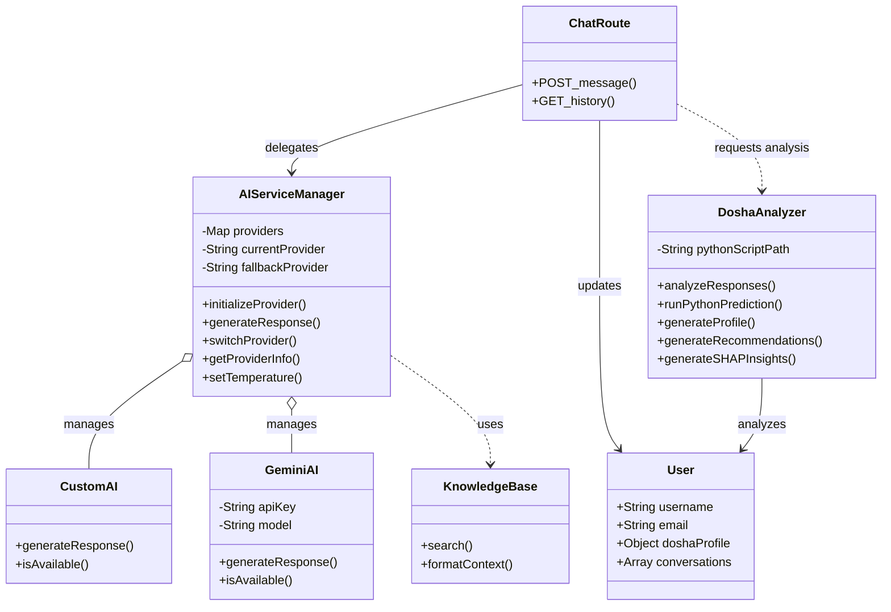

# AyurVAID System UML Class Diagram

The following class diagram illustrates the relationships between the core services, models, and components in the AyurVAID backend.

```mermaid
classDiagram
    class AIServiceManager {
        -Map providers
        -String currentProvider
        -String fallbackProvider
        +initializeProvider()
        +generateResponse()
        +switchProvider()
        +getProviderInfo()
        +setTemperature()
    }

    class CustomAI {
        +generateResponse()
        +isAvailable()
    }

    class GeminiAI {
        -String apiKey
        -String model
        +generateResponse()
        +isAvailable()
    }

    class KnowledgeBase {
        +search()
        +formatContext()
    }

    class DoshaAnalyzer {
        -String pythonScriptPath
        +analyzeResponses()
        +runPythonPrediction()
        +generateProfile()
        +generateRecommendations()
        +generateSHAPInsights()
    }

    class User {
        +String username
        +String email
        +Object doshaProfile
        +Array conversations
    }

    class ChatRoute {
        +POST_message()
        +GET_history()
    }

    AIServiceManager o-- CustomAI : manages
    AIServiceManager o-- GeminiAI : manages
    AIServiceManager ..> KnowledgeBase : uses
    ChatRoute --> AIServiceManager : delegates
    ChatRoute --> User : updates
    DoshaAnalyzer --> User : analyzes
    ChatRoute ..> DoshaAnalyzer : requests analysis
```
