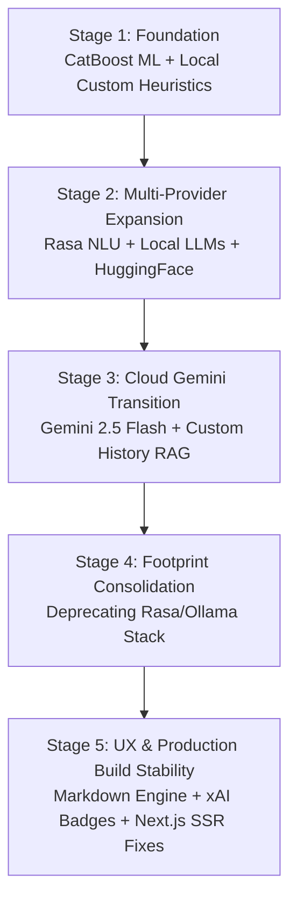

# AyurVAID System Evolution Timeline & Chronological Changelog

This document provides a chronological engineering record of the architectural changes, trial experiments, and optimizations implemented over the stages of the **AyurVAID** (AI-Powered Ayurvedic Health Intelligence System) development lifecycle.

It is structured stage-by-stage to display the initial starting states ("Before"), the evolution paths, and the ultimate optimized system structures ("After") for academic reviews and thesis presentation.

---

## 📈 Evolution Timeline at a Glance

---

## 📅 Stage 1: Establishing the Architectural Foundation
* **Focus:** Offline Diagnostic Accuracy & Classification Baselines
* **Status:** 🟢 Completed & Operational

### 🔍 System State
* **Before (Initial State):** No functional health diagnostics, Ayurvedic parsing pathways, or personal profile databases existed.
* **After (Stage Foundation):**
  - **CatBoost Prakriti Classifier:** Built a trained gradient-boosting model over a 5,000-row Prakriti dataset to classify users via 25 physiological inputs.
  - **SHAP explainability (xAI) Engine:** Native Python SHAP values (`get_feature_importance`) calculate precisely which user attributes contributed to dosha calculations.
  - **Offline Local Heuristics (`CustomAI.js`):** Built local, keyword-intent routines (digestion, mental health, exercise) mapping custom templates.
  - **JWT Firebase Security Core:** Implemented backend authentication middleware linked to Firebase.

### 🎓 Academic & Engineering Rationale
Prioritizing robust, high-performance offline classification models ensured system validity. Establishing the CatBoost SHAP parameters before implementing flexible natural language structures gave the system an auditable diagnostic anchor.

---

## 📅 Stage 2: Multi-Provider AI Exploration & Rasa NLU
* **Focus:** Flexible Natural Language Processing & Multi-Model Adaptations
* **Status:** 🟡 Trial Phase Completed (Later Simplified)

### 🔍 System State
* **Before (Stage 1 State):** The interface lacked conversational capabilities, entity parsing (detecting herbs/symptoms), or generative intelligence, relying purely on strict offline rules.
* **After (Stage Expansion):**
  - **Rasa NLU Server Integration:** Bound a custom Rasa NLP server running DIET intent transformers and entity parsers on port `5005`.
  - **Ollama / LocalAI Connection:** Created `LocalAI.js` mapping local LLMs (Mistral/Llama) to support offline conversational queries.
  - **HuggingFace Pipeline Integration:** Designed `HuggingFaceAI.js` binding DialoGPT parameters.
  - **Commercial LLM API Binds:** Enabled `AIServiceManager.js` to dispatch queries to OpenAI's GPT-4.
  - **RAG Pre-Extraction (`KnowledgeBase.js`):** Engineered static keyword searches across custom JSON arrays mapping 450+ herbs, principles, and medicines.

### 🎓 Academic & Engineering Rationale
Exploring character-level NLU pipelines (Rasa) and localized LLM runtimes (Ollama/HuggingFace) provided a modular NLP sandbox. This proved that hybrid keyword extraction and generative text could successfully solve complex Ayurvedic RAG queries.

---

## 📅 Stage 3: Transition to Cloud Gemini LLM & RAG Integration
* **Focus:** Context Retention, Prompt Engineering, & System Resilience
* **Status:** 🟢 Completed & Active

### 🔍 System State
* **Before (Stage 2 State):** Running heavy local models saturated deployment hardware, and legacy pipelines lacked strict prompt structures, safety bounds, or chat formatting.
* **After (System Migration):**
  - **Created `GeminiAI.js` Service:** Implemented the `@google/generative-ai` SDK utilizing the fast `gemini-2.5-flash` model.
  - **Ayurvedic Custom Instruction Engine:** Prepopulated advanced directives regarding *Rasa* (taste), *Virya* (potency), *Vipaka* (post-digestive effects), *Ritucharya* (daily routines), and *Dinacharya* (seasonal guidelines).
  - **Dynamic Prakriti Alignment:** The prompt engine automatically merges the user's ML-classified primary/secondary Dosha values to customize advice.
  - **Strict Chat History Sanitizer:** Developed `_sanitiseHistory()` to clean consecutive message roles and conform to Gemini's user/model alternation constraints.
  - **Exponential Backoff Retry Strategy:** Added a 3-stage retry logic (2s, 4s, 8s backoff) to bypass rate limitations (`RESOURCE_EXHAUSTED` / HTTP 429).

### 🎓 Academic & Engineering Rationale
Transitioning to Gemini 2.5 Flash solved semantic reasoning and medical contextual limitations. Anchoring the generative model with real-time RAG context prevented hallucinations, while exponential retry algorithms prevented API-side rate-limit failures.

---

## 📅 Stage 4: AI Footprint Consolidation & Stack Pruning
* **Focus:** Codebase Optimization & Infrastructure Simplification
* **Status:** 🟢 Completed & Active

### 🔍 System State
* **Before (Stage 3 State):** Codebase carried heavy, unused legacy files (`RasaAI.js`, `HuggingFaceAI.js`, `LocalAI.js`). Environment variables were bloated with credentials for multiple providers, slowing compilation.
* **After (Pruned Stack):**
  - **Filesystem Cleanup:** Erased deprecated files (`RasaAI.js`, `HuggingFaceAI.js`, `LocalAI.js`) from the services directory.
  - **Refactored `AIServiceManager.js`:** Streamlined the orchestrator to manage only two active nodes: `gemini` (Cloud Generative) and `custom` (Local Deterministic Fallback).
  - **Secured Configuration:** Erased Ollama URLs, OpenAI keys, and HuggingFace configs from `.env`.

### 🎓 Academic & Engineering Rationale
Simultaneous execution of multiple local models (Rasa + Ollama + HuggingFace) required over 12GB of RAM. Pruning the stack minimized memory footprints to **under 500MB RAM**, matching cheap cloud host thresholds, while the high-availability CustomAI fallback maintained offline security.

---

## 📅 Stage 5: UX Enhancements & Next.js SSR Build Stabilizers
* **Focus:** Visual Refinements & Production Readiness
* **Status:** 🟢 Completed & Active

### 🔍 System State
* **Before (Stage 4 State):** Chat output unformatted plain text blocks, which were hard to scan. Interactive interfaces lacked clarity regarding processing origins. Production builds crashed when pre-rendering components containing browser-only APIs (`localStorage`).
* **After (Polished System):**
  - **Markdown Integration:** Implemented React markdown parser helper routines (`renderMarkdown`) to format recipes, herbs, and diet schedules into clear bullet points and bold sections.
  - **Animated Active Service Badges:** Added sparkles badges (`✨ Gemini AI` or `⚙️ Rule Engine`) on messages for xAI audit transparency.
  - **Next.js SSR Hydration Guard:** Wrapped token lookups in `AuthContext.js` with `typeof window !== 'undefined'` conditional blocks.

### 🎓 Academic & Engineering Rationale
Clear formatting directly impacts UX accessibility in health applications. Active service indicators fulfill Explainable AI (xAI) transparency guidelines, while Next.js window checks allow standard production compilation (`npm run build`) to complete successfully.

---

## 📊 Summary Chronology Matrix

| Stage | Milestone | Primary Files Changed | Architectural Output |
| :--- | :--- | :--- | :--- |
| **Stage 1** | Foundation | `catboost_model.py`, `CustomAI.js` | Built Prakriti ML classification model, SHAP explainability panel, and local rules. |
| **Stage 2** | Multi-Provider | `RasaAI.js`, `LocalAI.js`, `KnowledgeBase.js` | Built modular NLP sandbox, Rasa DIET classifiers, local Ollama, and RAG. |
| **Stage 3** | Cloud Gemini | `GeminiAI.js`, `AIServiceManager.js` | Migrated chatbot to Gemini 2.5 Flash, added safety gates, history alignment, and rate retries. |
| **Stage 4** | Consolidation | `AIServiceManager.js`, `.env` | Deleted obsolete Rasa, Ollama, and HuggingFace files to reduce RAM usage to <500MB. |
| **Stage 5** | Production/UX | `ChatScreen.js`, `AuthContext.js` | Integrated markdown renderer, xAI badges, and Next.js SSR window protections. |

---

*Compiled as part of the AyurVAID System Evolution Timeline & Academic Thesis Guide.*
